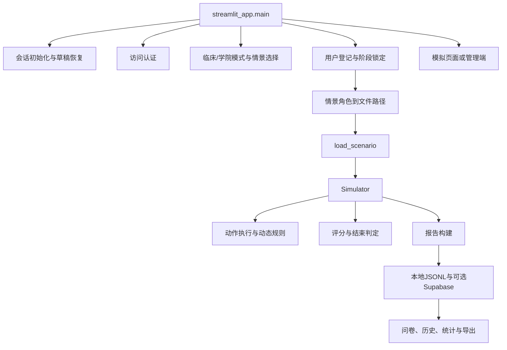

# MODULAR_ARCHITECTURE_PLAN.md

## 1. 评估范围与限制

评估对象：`app/`

评估日期：2026-07-01

本次仅进行静态架构评估：

* 阅读项目管理文档、Python源代码、JSON情景文件和测试文件；
* 不运行项目；
* 不运行测试；
* 不修改业务代码、病例、评分或医学内容；
* 不连接Supabase或其他外部服务；
* 不执行Git操作。

本文所称“139项测试通过”来自现有项目状态与测试报告，本次未重新执行。

## 2. 执行结论

当前系统属于：

`Streamlit单体入口 + 半配置化专用模拟引擎 + JSON情景脚本 + 脚本式回归测试`

主要结论：

1. `streamlit_app.py`共5433行，同时承担情景目录、流程编排、会话状态、恢复、认证、权限、存储、问卷、管理端、导出和全部页面渲染，职责明显过载。
2. `peds_anaphylaxis_sim/engine.py`共2537行，`Simulator`同时承担生命体征演化、分支判定、动作执行、评分、结束判定和报告构建。
3. JSON已经配置了患者基线、动作、动作效果、动态规则、结束表达式、训练提示及部分评分，但严重过敏反应专用动作和医学规则仍大量硬编码在Python中。
4. 临床/学院与训练/考核并非完全复制，但模式判断同时分布在入口、引擎、问卷、结果页和管理端，新增模式或情景会横跨多个区域修改。
5. 当前不适合直接增加一个医学主题不同的第二情景。若只是复用现有严重过敏反应动作体系的变体，可以继续试验；若包含新的动作、评分、生命体征或结束逻辑，直接添加会扩大硬编码和复制。
6. 推荐采用6个阶段重构。先建立行为契约和情景加载边界，最后才拆分评分、分支和生命体征核心。

## 3. 当前调用结构

入口编排证据：

* `app/streamlit_app.py:5408` `main`
* `app/streamlit_app.py:5411` `init_session`
* `app/streamlit_app.py:5412` `restore_training_draft_from_query`
* `app/streamlit_app.py:5413` `require_app_access`
* `app/streamlit_app.py:5415` `render_system_mode_selection_page`
* `app/streamlit_app.py:5417` `render_academy_scenario_selection_page`
* `app/streamlit_app.py:5420` 管理端路由
* `app/streamlit_app.py:5423` 登记页路由
* `app/streamlit_app.py:5426` 模拟入口路由

## 4. 当前文件与职责

| 文件或目录 | 当前职责 | 评价 | 证据 |
|---|---|---|---|
| `app/streamlit_app.py` | 页面、模式、流程、状态、恢复、认证、权限、存储、问卷、管理端、导出 | 主要单体，必须逐步减负 | 顶层函数从`current_system_mode`到`main`，见`:246-5433` |
| `app/peds_anaphylaxis_sim/engine.py` | 情景读取、模拟状态、动态规则、动作、评分、结束、报告 | 专用核心过于集中，高风险拆分对象 | `load_scenario` `:37`；`Simulator` `:80-2385` |
| `app/peds_anaphylaxis_sim/org_credentials.py` | 单位管理码加盐哈希生成、规范化、验证 | 边界较清晰，可保留并扩展 | `build_credential` `:77`；`verify_credential` `:133` |
| `app/peds_anaphylaxis_sim/scenarios/` | 4个完整JSON脚本 | 半配置化，初始/变体高度重复 | 临床各991行；学院各756行 |
| `app/tests/` | 9个脚本，覆盖139项测试 | 回归基础较好，但强耦合单体入口 | `full_workflow_validation.py:18-29`等 |

## 5. 临床、学院、训练和考核的混杂情况

### 5.1 已经分开的部分

* 临床与学院有独立评估阶段和流程规则：`streamlit_app.py:96-243`。
* 学院情景元数据和阶段脚本角色有独立目录定义：`streamlit_app.py:167-193`。
* 训练模式启用提示，考核模式随机操作顺序并隐藏反馈：`engine.py:81-96`、`streamlit_app.py:5125-5164`。
* 学院考核使用中性动作标签：`streamlit_app.py:2585-2590`。
* 学院和临床登记字段分别处理：`streamlit_app.py:3184-3589`。

### 5.2 仍然混杂的部分

1. 模式与流程规则直接定义在UI入口文件：
   * `SYSTEM_MODE_OPTIONS`：`streamlit_app.py:96`
   * `ACADEMY_SCENARIO_LIBRARY`：`streamlit_app.py:167`
   * `WORKFLOW_RULES`：`streamlit_app.py:196`
   * `workflow_for_phase`：`streamlit_app.py:284`
2. 学院专用动作和反馈进入核心引擎：
   * `_is_academy_basic_case`：`engine.py:1224`
   * `_record_academy_unsafe_action`：`engine.py:1229`
   * 学院动作分支：`engine.py:1396-1474`
   * 学院安全问题：`engine.py:2021-2059`
3. 临床和学院结束流程在同一保存函数中分叉：
   * `_save_and_end_report`：`streamlit_app.py:3063-3102`
4. 学院问卷门控依赖情景专用时间轴键：
   * `ACADEMY_POST_TEST_REQUIRED_TIMELINE_KEYS`：`streamlit_app.py:2792-2800`
   * `_academy_post_test_fully_completed`：`streamlit_app.py:2803`
5. 当前动作可见性同时依赖UI模式、情景目标人群和具体动作ID：
   * `visible_actions_for_current_state`：`streamlit_app.py:5054-5091`

结论：模式差异已经存在，但尚未形成独立的“模式策略”或“流程策略”。当前属于条件分支分离，不属于模块边界分离。

## 6. 情景配置化程度

| 项目 | 状态 | 当前实现 | 证据 |
|---|---|---|---|
| 情景元数据 | 可配置 | ID、版本、角色、目标人群在JSON | 临床JSON`:3-16`；学院JSON`:3-21` |
| 患者与基线 | 可配置 | 患者信息、生命体征、症状、flags在JSON | 临床JSON`:42`；学院JSON`:55` |
| 动作清单 | 可配置 | 动作ID、标签、分值和基础effects在JSON | 临床JSON`:163`；学院JSON`:183` |
| 基础动作效果 | 可配置 | `set_flags`、计数、生命体征和症状增量 | `engine.py:373-401` |
| 时间动态规则 | 可配置但有风险 | JSON表达式经`safe_eval`执行 | 临床JSON`:587-871`；`engine.py:70-78,464-500` |
| 训练提示 | 可配置 | `guided_prompts`和`done_when` | 临床JSON`:883-984`；学院JSON`:594-638` |
| 结束表达式 | 部分可配置 | 成功/失败表达式在JSON，但普通临床完成另有硬编码 | JSON `end_conditions`；`engine.py:1966-2016` |
| 模块评分 | 部分可配置 | 学院可覆盖，临床默认模块和边界写在引擎 | `engine.py:102-170,760-854`；学院JSON`:662-739` |
| 分支前置条件 | 大量硬编码 | 按具体动作ID和flags执行 | `engine.py:1272-1610` |
| 医学剂量判断 | 硬编码 | 肾上腺素、补液、激素规则位于引擎和UI | `engine.py:1611,1759,1869`；`streamlit_app.py:4837-4977` |
| 生理恢复与危重判定 | 硬编码 | 年龄边界、心搏骤停、ROSC、高级支持 | `engine.py:403-463,929-1197` |
| 错误反馈 | 部分可配置 | JSON有标签/effects，核心反馈文本仍在Python | `engine.py:1300-1610,2018-2145` |
| 报告结构 | 硬编码 | 固定时间轴和临床/学院flags | `engine.py:2165-2384` |

总体判断：病例脚本“数据化”程度中等，但分支引擎、评分引擎和医学动作处理仍是严重过敏反应专用实现。

## 7. 用户与后台能力的复用性

| 能力 | 复用性 | 主要问题 | 证据 |
|---|---|---|---|
| 用户登记 | 低到中 | 临床和学院表单在同一407行函数内分叉，字段写入直接操作`st.session_state` | `render_participant_entry_page` `streamlit_app.py:3184-3590` |
| 普通认证 | 中 | 凭据读取和恒定时间比较较独立，但直接依赖`st.secrets`和Streamlit停止 | `streamlit_app.py:970-1021` |
| 单位认证 | 中到高 | 哈希算法已独立；身份加载、签发和校验仍在入口文件 | `org_credentials.py:21-157`；`streamlit_app.py:1024-1200` |
| 权限过滤 | 中到高 | 数据层已有显式授权上下文，但实现仍与页面文件混放 | `streamlit_app.py:1148-1234,1760-1952` |
| 会话恢复 | 中 | 快照能力完整，但文件存储、浏览器绑定和Streamlit状态耦合 | `streamlit_app.py:628-859`；`engine.py:203-327` |
| 结果保存 | 中 | 本地幂等和锁较成熟，但路径、数据库和UI消息耦合 | `streamlit_app.py:1546-1882` |
| 问卷 | 低到中 | 题目、计算、状态、持久化和页面在同一文件，且学院课后考核专用 | `streamlit_app.py:123-145,2792-3061` |
| 管理端 | 低 | 登录、数据源选择、过滤、统计、预览和下载集中在222行函数 | `render_admin_page` `streamlit_app.py:4615-4836` |
| 导出 | 中到高 | CSV/JSONL函数已接收授权上下文，可作为服务提取 | `streamlit_app.py:1907-1952` |

## 8. 新增第二个情景的实际改动面

### 8.1 当前必须改动的位置

若新增学院第二情景，至少会涉及：

1. 新增初始和变体JSON文件，因为当前每个情景按课前/训练与课后脚本角色组织。
2. 修改`ACADEMY_SCENARIO_LIBRARY`：`streamlit_app.py:167-193`。
3. 增加新的`script_role`，并修改固定角色白名单和排序：
   * `list_scenarios`：`streamlit_app.py:359-376`
   * `scenario_path_by_role`：`streamlit_app.py:379-389`
4. 为新情景提供阶段角色、标签和任务：
   * `workflow_for_phase`：`streamlit_app.py:284-307`
5. 若动作ID不同，需要修改：
   * 考核中性标签：`streamlit_app.py:147-165`
   * 动作可见性：`streamlit_app.py:5054-5091`
   * 输入面板和点击分派：`streamlit_app.py:4837-4977,5166-5217`
   * `Simulator.apply_action`：`engine.py:1272-1610`
   * 评分、完成条件、安全问题和报告字段：`engine.py:760-907,1966-2384`
6. 更新测试中的固定场景列表：
   * `tests/full_workflow_validation.py:22-29`
   * `tests/version_consistency_tests.py:35-54`

### 8.2 当前复制量

现有初始/变体脚本高度重复：

* 临床初始与变体：991行中977个相同位置行相同，位置相似度98.6%。
* 学院初始与变体：756行中736个相同位置行相同，位置相似度97.4%。

该统计是文本位置比较，不代表医学语义完全相同，但足以说明新增情景若继续采用整文件复制，会扩大维护和审计成本。

### 8.3 是否适合直接增加

结论：不建议直接增加一个医学主题不同的第二情景。

原因：

* 情景选择按固定`script_role`而不是`scenario_id + phase`定位；
* 引擎按严重过敏反应动作ID执行专用分支；
* 评分、报告和UI输入面板依赖固定动作；
* 当前测试清单固定列出4个JSON；
* 初始/变体文件已经存在高重复。

可接受的临时例外：新情景完全复用现有动作、flags、评分和报告语义，仅替换患者背景或少量动态参数。但这种做法仍应先经过情景契约验证，不能据此认定架构已经支持通用场景。

## 9. 推荐目标模块

| 目标模块 | 建议职责 | 优先级 |
|---|---|---|
| 核心流程引擎 | 保留稳定`Simulator`外观，协调状态、动作、tick和结束，不包含Streamlit | 必须建立兼容边界 |
| 情景加载器 | 读取、验证、索引情景；按`scenario_id + phase`解析脚本 | 必须先拆分 |
| 场景库 | 独立manifest记录名称、类别、阶段、脚本、适用人群和开放状态 | 必须先拆分 |
| 流程策略 | 定义临床/学院、训练/考核、阶段到脚本和反馈策略 | 必须先拆分 |
| 分支引擎 | 解释动作前置条件、效果、动态规则和结束条件；专用动作通过注册处理器扩展 | 核心高风险，后拆 |
| 评分引擎 | 模块、边界、分项、扣分、评分事件和汇总 | 核心高风险，后拆 |
| 会话恢复 | 草稿序列化、校验、过期、绑定和存储；不直接控制页面 | 必须在流程层稳定后拆分 |
| 数据存储 | 本地JSONL与Supabase实现统一Repository接口 | 必须在管理端重构前拆分 |
| 认证与权限 | 应用凭据、单位身份、授权上下文和过滤规范 | 已有基础，继续拆分 |
| 问卷 | 问卷定义、计分、草稿、提交和结果关联 | 可后续拆分 |
| 管理端 | 查询、筛选、统计和导出服务；Streamlit仅负责展示 | 可后续拆分 |
| UI适配层 | Streamlit路由、组件和状态映射 | 可后续拆分 |

## 10. 必须先重构、可后续重构和暂时不应动

### 10.1 必须先重构

1. 情景目录、加载和验证：
   * 消除`script_role`全局唯一假设；
   * 引入`scenario_id + phase/script_variant`定位；
   * 验证ID唯一性、动作引用、动态表达式字段和评分总分。
2. 模式与阶段流程策略：
   * 从`streamlit_app.py`移出`ACADEMY_SCENARIO_LIBRARY`和`WORKFLOW_RULES`；
   * 用纯数据对象返回模式、脚本、提示和结束后流程。
3. 兼容外观和行为契约：
   * 保持`Simulator`、报告、快照和现有调用签名不变；
   * 在拆分前建立金标准报告和快照往返测试。
4. 数据访问接口：
   * 保留所有授权上下文参数；
   * 管理端不能直接绕过Repository读取全量数据。

### 10.2 可后续重构

* 临床/学院登记表单组件；
* 问卷定义和页面组件；
* 管理端筛选、统计和表格渲染；
* 导出格式化；
* CSS和状态卡片；
* README与开发者文档组织。

### 10.3 暂时不应动

在医学依据索引和金标准测试未完成前，不应修改：

* 4个现有情景JSON中的医学内容；
* 药物剂量、补液范围、生命体征阈值；
* 当前评分权重、延迟边界和扣分；
* 成功、失败、心搏骤停、ROSC和转PICU逻辑；
* 报告字段、JSONL结构、完成标识和问卷提交标识；
* 快照`schema_version = 1`和既有恢复兼容；
* Supabase表结构和生产连接方案。

## 11. 测试对模块化重构的支持程度

### 11.1 已有优势

* 4个现有场景的临床/学院、训练/考核标准路径已覆盖：
  `tests/full_workflow_validation.py:199-225`。
* 全部声明动作的基础执行有覆盖：
  `tests/full_workflow_validation.py:267-283`。
* 会话恢复覆盖四类流程、过期、损坏和跨浏览器：
  `tests/session_recovery_tests.py:140-277`。
* 临床结果页、重复保存和刷新恢复有覆盖：
  `tests/clinical_result_page_tests.py:109-254`。
* 问卷恢复、幂等、并发和损坏行有覆盖：
  `tests/academy_questionnaire_idempotency_tests.py:191-439`。
* 权限、数据读取和导出边界有32项覆盖：
  `tests/organization_authorization_tests.py:198-418`。
* 现有场景文件哈希被锁定，可防止重构误改病例：
  `tests/version_consistency_tests.py:35-54,93-99`。

### 11.2 当前不足

1. 多数测试直接导入`streamlit_app`并patch全局对象，说明行为覆盖较强，但模块边界不存在：
   * `full_workflow_validation.py:18`
   * `session_recovery_tests.py:14`
   * `organization_authorization_tests.py:18`
2. 场景文件路径和列表硬编码，不能自动发现第二情景：
   * `full_workflow_validation.py:22-29`
3. 缺少情景schema、动作引用、唯一ID和阶段映射契约测试。
4. 缺少评分事件和报告的完整金标准快照。
5. 缺少“同一输入在重构前后生成相同状态、分数和报告”的差分测试。
6. 测试仍为9个独立脚本，不是统一测试框架入口。

结论：现有测试足以支撑小步搬移，但不足以保护一次性拆分`Simulator`或替换分支表达式执行器。

## 12. 最小风险分阶段顺序

推荐共6个阶段。

### 12.1 路线图语义与实际交付记录

本节于2026-07-03根据Git提交历史和Pull Request记录完成校准。

* 本文件在提交`49bb5bc`中首次建立六阶段路线图；后续未发现经`docs/DECISIONS.md`、Pull Request说明或提交说明确认的阶段重排决策。
* “模块化第1、2、3阶段”曾被同时用于功能分支和交付批次名称。交付批次名称属于历史记录，不改变本节六阶段路线图的原始语义。
* 原路线图阶段1由PR #2完成，合并提交为`1114a21`，测试基线为175/175。
* 原路线图阶段2分两次交付：PR #3完成情景目录和加载器，合并提交为`55afcaa`，测试基线为197/197；PR #4完成流程策略，合并提交为`d023d93`，测试基线为224/224。
* PR #4在历史上使用“模块化第3阶段：流程策略拆分”作为交付名称。该名称和完成记录予以保留，但其工作内容属于原路线图阶段2中尚未交付的流程策略部分，不据此顺延后续阶段编号。
* PR #4只集中声明了会话恢复策略，并在恢复时增加流程策略身份核对；应用流程协调器、显式状态转换、草稿文件操作与Streamlit query/session适配分离尚未完成，仍属于原路线图阶段3。
* 当前下一阶段是原路线图阶段3。原路线图阶段4的唯一正式名称仍为“拆分认证、存储、问卷和管理服务”。

### 阶段1：建立行为契约，不改运行路径（已完成）

目标：

* 新增情景schema验证测试；
* 新增4个现有场景的目录解析和唯一性测试；
* 为临床/学院标准路径建立报告金标准；
* 建立快照往返和重构前后差分测试；
* 明确报告、JSONL和授权接口契约。

本阶段不移动现有函数，不修改JSON，不改变任何页面。

### 阶段2：拆分情景目录、加载器和流程策略（已完成，分两次交付）

目标：

* 建立场景manifest和纯Python加载器；
* 用`scenario_id + phase`解析具体脚本；
* 从入口文件移出模式、阶段和情景元数据；
* 保留现有4个脚本及原输出。

### 阶段3：拆分应用流程和会话恢复（当前下一阶段，未完成）

目标：

* 建立应用流程协调器；
* 将开始、完成、结果页、返回和重置转为显式状态转换；
* 将草稿文件操作与Streamlit query/session适配分开；
* 保持快照schema和恢复行为不变。

### 阶段4：拆分认证、存储、问卷和管理服务（后续阶段，未开始）

目标：

* 认证和授权形成独立服务；
* 本地JSONL与Supabase实现同一存储接口；
* 问卷提交服务只依赖存储和完成记录；
* 管理端只接收已授权查询结果；
* 导出函数保持二次授权检查。

### 阶段5：拆分核心分支、评分和报告（后续阶段，未开始）

目标：

* `Simulator`保留兼容外观；
* 动作执行转为通用处理器加注册式专用处理器；
* 动态规则、评分事件和报告构建分别隔离；
* 每次只迁移一类动作或一个评分模块；
* 所有金标准和139项回归持续通过。

这是最高风险阶段，不应与新增情景同时进行。

### 阶段6：接入第二情景（后续阶段，未开始）

目标：

* 通过manifest添加情景，不修改入口路由；
* 为新情景提供独立动作处理器和评分策略；
* 临床/学院、训练/考核回归同时通过；
* 医学内容完成专家核查和来源追溯；
* 不复制既有严重过敏反应专用Python分支。

## 13. 第一阶段建议修改范围

第一阶段建议仅新增测试和纯验证代码：

* 新增情景契约验证器；
* 新增情景目录自动发现测试；
* 新增报告金标准夹具；
* 新增`Simulator.to_snapshot/from_snapshot`往返测试；
* 新增4场景标准路径差分测试；
* 新增报告字段、存储记录和授权上下文契约测试。

第一阶段明确不修改：

* `streamlit_app.py`运行流程；
* `engine.py`医学逻辑；
* 4个JSON情景；
* 评分、问卷、权限和存储格式；
* 系统版本号。

验收标准：

1. 现有139项测试继续通过；
2. 新增契约测试全部通过；
3. 4个情景文件哈希不变；
4. 标准路径最终状态、分数、问题列表和报告字段不变；
5. 无Supabase连接和业务数据残留。

## 14. 高风险重构点

| 风险 | 原因 | 控制措施 |
|---|---|---|
| 评分漂移 | 动作分值来自JSON，但时序边界和专用分项在引擎 | 金标准评分事件和模块汇总差分 |
| 医学逻辑漂移 | 剂量、生命体征、危重分支分布在UI与引擎 | 先锁定医学规则，不在搬移时改公式 |
| 结束条件漂移 | JSON表达式与Python普通结束条件并存 | 对每个结束原因建立专项测试 |
| 会话恢复失效 | 快照包含完整场景和内部状态 | 保持兼容外观与schema，建立旧快照夹具 |
| 数据兼容破坏 | 报告、JSONL、问卷和导出共享字段 | 先定义版本化数据契约 |
| 权限回归 | 管理端和导出曾出现页面层过滤问题 | 所有Repository和导出接口强制授权上下文 |
| 问卷结果丢失 | 训练保存、问卷草稿和幂等相互关联 | 保持“先保存训练结果”顺序和稳定ID |
| 表达式安全 | `safe_eval`仍调用Python `eval` | 单独立项替换，不能与模块搬移同时进行 |
| 变体误合并 | 初始/变体文本高度相似但医学差异重要 | 不自动合并JSON，先做语义差异清单和专家确认 |

## 15. 最终建议

1. 当前不应把“存在情景选择页”理解为已经具备通用情景插件能力。
2. 第二情景开发前，最低前置条件是完成阶段1和阶段2。
3. 若第二情景引入新的生命体征、动作类型或评分逻辑，还应先完成阶段5中的对应兼容处理器边界。
4. 核心医学逻辑不应在重构搬移过程中顺便优化。
5. 每个阶段应独立提交、独立测试、独立审查，并保留可回滚点。

## 16. 主要证据索引

* 入口与页面路由：`app/streamlit_app.py:5408-5429`
* 模式、阶段和情景目录：`app/streamlit_app.py:96-307`
* 情景文件发现与角色定位：`app/streamlit_app.py:359-389`
* 会话状态和草稿字段：`app/streamlit_app.py:431-859`
* 认证与权限：`app/streamlit_app.py:970-1254`
* 本地/数据库存储与导出：`app/streamlit_app.py:1431-1952`
* 启动、完成和问卷：`app/streamlit_app.py:2632-3133`
* 用户登记：`app/streamlit_app.py:3184-3590`
* 管理端：`app/streamlit_app.py:4584-4836`
* 模拟页面动作分派：`app/streamlit_app.py:4837-5250`
* 核心模拟器：`app/peds_anaphylaxis_sim/engine.py:80-2385`
* 动态规则执行：`app/peds_anaphylaxis_sim/engine.py:373-500`
* 评分边界：`app/peds_anaphylaxis_sim/engine.py:760-907`
* 动作专用分支：`app/peds_anaphylaxis_sim/engine.py:1224-1965`
* 结束、安全问题和报告：`app/peds_anaphylaxis_sim/engine.py:1966-2384`
* 单位凭据模块：`app/peds_anaphylaxis_sim/org_credentials.py:21-157`
* 场景配置示例：`app/peds_anaphylaxis_sim/scenarios/peds_ward_anaphylaxis_iv_initial.json`
* 学院配置示例：`app/peds_anaphylaxis_sim/scenarios/peds_ward_allergy_academy_initial.json`
* 回归测试：`app/tests/`
